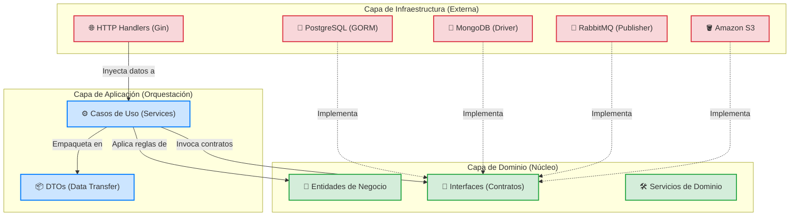

# 🏗️ Arquitectura del Proyecto

**EduGo API Mobile** está construida sobre cimientos sólidos siguiendo estrictamente los principios de **Clean Architecture** y **Domain-Driven Design (DDD)**. Esta decisión de diseño garantiza una separación cristalina de responsabilidades, lo que se traduce en un sistema altamente testable, mantenible y preparado para escalar sin fricciones.

> [!NOTE]
> La regla de oro en esta arquitectura es la **Regla de Dependencia**: Las dependencias del código fuente *solo* pueden apuntar hacia adentro, hacia el núcleo de las reglas de negocio (Dominio).

---

## 🗺️ Mapa de Referencia (Clean Architecture)

El siguiente diagrama ilustra cómo las distintas capas interactúan entre sí, manteniendo el núcleo de dominio aislado de las tecnologías volátiles (Bases de datos, Frameworks HTTP, etc.).

---

## 🗂️ Estructura de Directorios Detallada

El proyecto se divide principalmente en el directorio `internal/`, organizado en las capas descritas a continuación:

### 1. `cmd/` (El Arrancador)
Contiene el punto de entrada de la aplicación (`main.go`). 
* **Responsabilidad:** Su *única* responsabilidad es inicializar el mundo. Carga las configuraciones, inicializa el Contenedor de Inyección de Dependencias (DI) y levanta el servidor HTTP. No contiene lógica de negocio.

### 2. Capa de Infraestructura (`internal/infrastructure/`)
Es la capa más externa, el borde de nuestro sistema. Aquí es donde nuestro código habla con el mundo real.
* 🌐 **HTTP:** Aloja los Controladores (Handlers), Middlewares (CORS, Auth, Logs estructurados, Métricas de Prometheus) y el enrutador (`router.go`) potenciado por Gin Framework.
* 💾 **Persistencia:** Implementaciones reales de los repositorios. Es un sistema políglota:
  * **PostgreSQL:** Repositorios implementados con GORM para datos relacionales y transaccionales (Neon).
  * **MongoDB:** Repositorios implementados con `mongo-driver` para modelos documentales flexibles y auditoría (Atlas).
* 📨 **Mensajería:** Clientes para publicar eventos a sistemas de colas como RabbitMQ (`publisher.go`).
* ☁️ **Almacenamiento:** Clientes para interacción directa con Amazon S3 (`s3.go`) para activos multimedia.

### 3. Capa de Aplicación (`internal/application/`)
El director de orquesta. Contiene los **Casos de Uso** del sistema.
* ⚙️ **Services:** Implementan el flujo paso a paso de lo que la aplicación puede hacer (ej. `assessment_service.go`, `material_service.go`). Validan entradas pidiendo ayuda al Dominio y comandan a la Infraestructura.
* 📦 **DTOs (Data Transfer Objects):** Modelan las estructuras de datos exactas que entran y salen de los endpoints HTTP. 
  > [!TIP]
  > Esto es crucial: **Nunca** exponemos un modelo de Dominio directamente en una respuesta HTTP. Los DTOs nos protegen de cambios accidentales.

### 4. Capa de Dominio (`internal/domain/`)
El corazón puro del sistema ❤️. Contiene las entidades y las reglas de negocio indelebles.
* 🧠 **Entidades:** Estructuras de datos puras de Go, sin etiquetas de GORM o JSON (idealmente).
* 🛠️ **Servicios de Dominio:** Lógica de negocio intrincada que abarca múltiples entidades y no encaja en un método de una entidad individual (ej. `scoring.go` para calcular puntajes complejos).
* 🔌 **Interfaces de Repositorios:** Define los contratos que la infraestructura *debe* cumplir (`repositories.go`). Esto es la encarnación del **Principio de Inversión de Dependencias (DIP)** de SOLID.

### 5. Configuración y Bootstrap (`internal/config/`, `internal/container/`)
* ⚙️ **Config:** Unifica y tipa fuertemente las variables de entorno, validando que el entorno sea sano antes de arrancar.
* 🧩 **Container (DI):** Instancia la gráfica de dependencias. Crea las conexiones de DB, las pasa a los repositorios, estos a los servicios, y finalmente a los Handlers.

---

> [!IMPORTANT]
> Mantener esta frontera arquitectónica limpia asegura que si mañana cambiamos MongoDB por DynamoDB, o Gin por Fiber, la lógica de negocio (Aplicación y Dominio) **no sufrirá ninguna mutación**.
