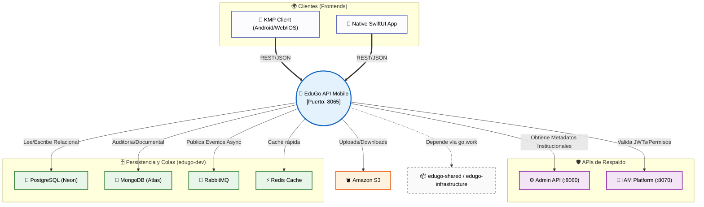

# 🌍 Relación con el Ecosistema EduGo

La **EduGo API Mobile** (este proyecto) es un engranaje vital que no opera de manera aislada. Funciona como la columna vertebral de la experiencia de cara al usuario final dentro del ecosistema de microservicios de EduGo.

Este documento ilustra su posicionamiento técnico y las interacciones de red dentro de la constelación de servicios.

---

## 📍 Posicionamiento en el Sistema

* **Directorio Raíz:** `/Users/jhoanmedina/source/EduGo/EduBack/edugo-api-mobile-new`
* **Naturaleza:** API REST de Alto Rendimiento (Go/Gin)
* **Puerto Local:** `8065`

El objetivo primordial de esta API es **servir a los clientes front-end** que utilizan los estudiantes, familias y tutores. Absolve el mayor volumen de tráfico concurrente: peticiones de lecturas de contenido, *streaming* de recursos, validación de exámenes interactivos y gestión del progreso en tiempo real.

---

## 🕸️ Diagrama de Contexto de Red

El siguiente diagrama detalla cómo los diferentes actores externos, APIs internas y recursos de bases de datos interactúan con la **Mobile API**.

---

## 🔌 Integración y Dependencias

### 1. APIs Hermanas (Upstream)
Para bootear y resolver ciertas lógicas, la API Mobile confía en:
* ⚙️ **EduGo API Admin New (8060):** Invocada mediante HTTP (`AUTH_API_ADMIN_BASE_URL`). Se usa fundamentalmente para sincronizar metadatos, parámetros institucionales y restricciones globales antes de despachar contenido al usuario.
* 🔐 **EduGo API IAM Platform (8070):** El motor criptográfico y de identidades. Todo middleware de seguridad que decodifica un JWT delega de alguna forma su validación o sus jerarquías de permisos a esta plataforma.

> [!TIP]
> **Secuencia de Encendido Local Correcta:**
> 1. Inicie la capa de infraestructura (DBs/Colas)
> 2. `IAM Platform` (:8070)
> 3. `Admin API` (:8060)
> 4. `Mobile API` (:8065)

### 2. Clientes Consumidores (Downstream)
El contrato HTTP que expone esta API es empaquetado y consumido estrictamente por:
* 🤖/🌐 **kmp_new:** Frontend basado en *Kotlin Multiplatform*. Es el cliente canónico multiplataforma. En entornos de emulación Android, su *Host* HTTP objetivo se ajustará a `10.0.2.2:8065`.
* 🍎 **apple_new:** Interfaz moderna codificada 100% en SwiftUI nativo para la próxima generación del ecosistema Apple.

---

## 🛠️ Infraestructura Subyacente (`edugo-dev-environment`)

Nuestras capacidades técnicas son potenciadas por un stack administrado externamente:

* **PostgreSQL (Neon):** El almacén de tablas duras. Usado para estructuras fuertemente consistentes (esquemas `academic`, `content`, `assessments`). 
  > [!CAUTION]
  > Las mutaciones de Schema se dictan ***únicamente*** desde `edugo-infrastructure`. Nunca intente aplicar migraciones desde este proyecto.
* **MongoDB (Atlas):** Nuestro hub de alta flexibilidad. Almacena trazas complejas de `Scoring`, registros masivos de logs de auditoría sin colapsar las bases de datos relacionales, y documentos cacheados (como los *Material Summaries*).
* **RabbitMQ:** La Mobile API actúa fuertemente como un **Productor (Producer)**. Por ejemplo, al finalizar un examen, se inyecta un evento en cola para evitar bloquear el *request* del usuario, permitiendo a los *Workers* procesar la calificación real asíncronamente.
* **Redis:** Distribuye el almacenamiento temporal para rebajar la contención en la base de datos principal, utilizando un pool manejado por las librerías compartidas.
* **Amazon S3:** Empleado a través de URLs Pre-firmadas para no cruzar *binarios* a través de nuestra API, garantizando latencias ultra-bajas en las cargas multimedia.

---

## 📦 Dependencias de Código (Go Workspace)

Bajo el capó de Golang, el proyecto se acopla a librerías propietarias a través de `go.work` para garantizar estandarización de tipos:

1. **`edugo-shared`:** El cinturón de utilidades base.
   * `middleware/gin`: Nos provee validaciones JWT en cadena sin tener que reinventar la rueda.
   * `logger`: Estandariza la salida Zap JSON.
   * `common/types`: Enums fijos de los contratos de la empresa (Ej: `PermissionMaterialsRead`).
2. **`edugo-infrastructure`:** La **Fuente de la Verdad**. Contiene los Modelos GORM, BSON y los eventos de mensajería compartidos.
   > [!WARNING]
   > Nunca declare una estructura en `internal/domain` que deba comportarse directamente como un persistente con tags ORM si esta ya existe en `edugo-infrastructure`. Promueva su inclusión allá primero.
