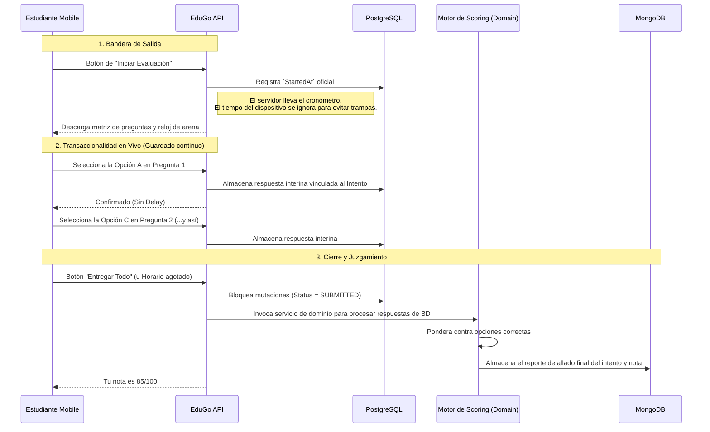

# 📝 Dominio: Motor de Evaluaciones (Assessment System)

En EduGo, el proceso de realizar y calificar una evaluación está envenado con riesgos técnicos: desconexiones móviles, intentos de fraude por parte de estudiantes que pausan el reloj local de sus dispositivos, y fallos de servidores. 

Para lidiar con esto, el dominio aborda el proceso de evaluaciones (Assessments) como transacciones complejas divididas en **Intentos de Resolución (Attempts)**.

---

## 🏗️ 1. Fase de Arquitectura (Profesores)

El área académica debe construir el "plano" de la evaluación. 

* **Composición Molecular:** Los administradores crean el objeto `Assessment` estableciendo restricciones (por ejemplo, tiempo máximo: 30 minutos). Luego, agregan un *Pool* de `Questions` de diferentes formatos (opción múltiple, respuesta libre).
* **Restricción de Visibilidad:** Mientras un profesor edita preguntas, el estado es `Draft`. Ningún estudiante, incluso si consigue el UUID del examen, puede inicializarlo. Solo cuando es marcado como `Published`, se revela a los estudiantes calificados.

---

## 🕵️‍♂️ 2. Fase de Ejecución: El Intento del Estudiante

El diseño principal defiende al estudiante ante todo. Si un alumno entra a un tren y pierde el 4G durante un examen, el sistema está diseñado para proteger sus respuestas (Prevención de pérdida de progreso).

### El Paradigma del Servidor Autorizado

* **El Tiempo es absoluto:** Debido a que el alumno puede cerrar la aplicación y alterar el reloj del teléfono, la API no confía en `time_spent` enviado en JSON desde la App. Cuando el estudiante llama al *Start Attempt*, guardamos un `StartedAt` de servidor. Al consultar el estado u horas después querer entregar, el backend compara silenciosamente: `Current_Time_Server - StartedAt`. Si eso supera el límite configurado (`TimeLimit` del examen), las entregas son penalizadas o rechazadas automáticamente en la capa de servicio de dominio.
* **Calificaciones Complejas:** Para no atorar a Postgres almacenando los perfiles de corrección JSON gigantes ("el usuario falló la pregunta 2 cuyo feedback esperado era X, respondiendo Y"), PostgreSQL retiene el esqueleto seguro del `Attempt` (Estado, Cuándo), pero el objeto de calificaciones final con alto impacto de lectura (*El Reporte Detallado*) se consolida asíncronamente en **MongoDB**.
