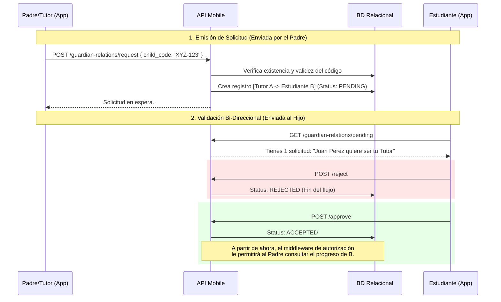

# 👨‍👩‍👧 Dominio: Ecosistema Familiar (Guardian)

En EduGo, los menores requieren una red de apoyo. Sin embargo, por leyes de protección de datos infantiles, no podemos de forma arbitraria otorgar acceso a las calificaciones de un menor a cualquier cuenta de adulto. 

Para resolver esto, hemos orquestado un protocolo estricto de **Handshake (Apretón de Manos)** de Custodia que el sistema valida minuciosamente.

---

## 🤝 El Protocolo de Vinculación (Handshake Protocol)

Una cuenta nace siendo completamente privada. Para que un padre pueda supervisarla, el proceso sigue un flujo auditable.

### Notas del Protocolo
1. **La Petición (Request):** El perfil del "Tutor" genera un ticket de solicitud. Ingresa un código tokenizado de su hijo o, si se permite por directriz de la escuela, su correo institucional.
2. **Excepciones Sub-10 años:** En el caso de alumnos de grados iniciales, este paso del "Estudiante Aceptando" puede ser automatizado y aprobado desde la **Admin API** por la escuela durante la matrícula.

---

## 📊 La Experiencia de Supervisión (Dashboard Paterno)

Una vez se sella el *handshake*, la API comienza a operar como un "Espejo Filtrado" (Proxy).

Cuando el padre inicia sesión en la aplicación, el motor de UI detecta su Rol (`Guardian`) y en lugar de ofrecerle cursos de matemáticas, le entrega un panel de control con el array de UUIDs de sus **Pupilos**.

### 🔍 Privacidad Estricta en la Lectura de Datos
Cada vez que el padre solicita la lectura de las notas de un alumno, la Capa de Dominio intercepta la orden:
* Examina si el `CurrentUserID` es el Tutor oficial del `RequestedTargetChildID` extraído del parámetro.
* Si no hay registro `ACCEPTED` en la base de datos relacional, el sistema escupe de inmediato un violento error `ErrUnauthorizedGuardian` o un `404 Not Found` (Ocultamiento deliberado).

### 📈 Agregación de Impactos
El sistema no inunda al padre con detalles granulares de cada clic. 
El flujo de *Dashboard* se apoya en una Vista Resumida donde la API calcula horas proyectadas de estudio versus horas reales ejecutadas. De esta manera, el tutor no audita el proceso microscópico del aprendizaje de su hijo, sino la salud estructural de sus hábitos.
