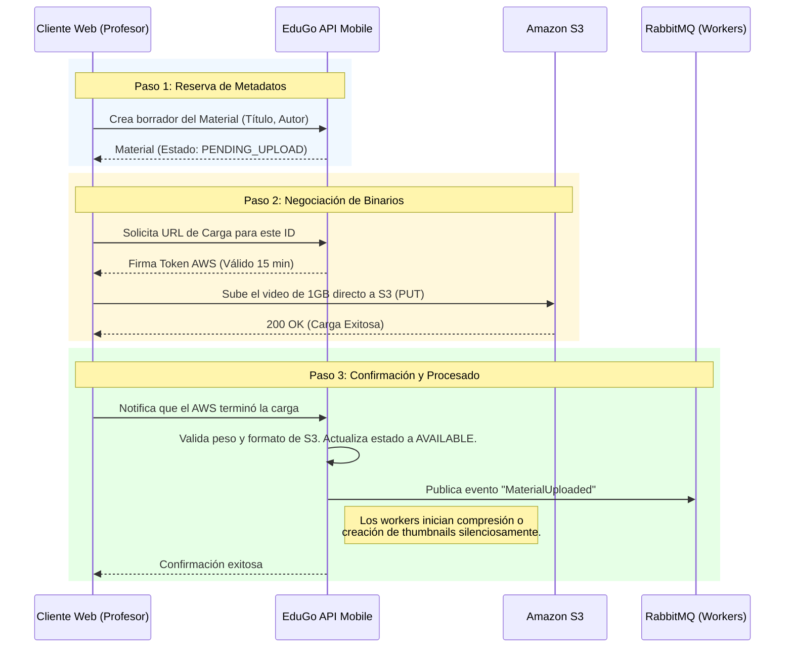

# 📚 Dominio: Material Educativo

En EduGo, el **Material** no es simplemente un registro en base de datos. Es el recurso fundamental de consumo (Videos pesados, PDFs, interactivos). 

Dado que alojamos contenido multimedia masivo, el proceso de negocio evita intencionalmente que los archivos pasen por la memoria RAM del servidor de la API, delegando la responsabilidad de infraestructura pesada directamente a **Amazon S3**.

---

## 📥 El Flujo de Publicación (Ciclo de Vida)

Cuando un administrador o profesor decide publicar un nuevo recurso, el proceso consta de una **"Danza de Tres Pasos"** diseñada para latencia cero.

---

## 📖 El Flujo de Consumo Estudiantil

Desde la perspectiva del estudiante (App Móvil), la lectura del material educativo debe ser instantánea y segura.

1. **Exploración de Catálogo:**
   El estudiante abre la app. La API le devuelve un listado ágil (solo metadatos ligeros y URIs de portadas recortadas). El catálogo está filtrado según los permisos de suscripción y nivel académico del usuario (Autorización evaluada por middleware).

2. **Acceso Seguro a Recursos (Evadiendo Piratería):**
   Para reproducir un video privado o descargar el PDF, el estudiante no recibe una URL pública permanente (ej: `https://s3.aws.com/edugo-bucket/modulo1.pdf`).
   - El estudiante solicita "ver".
   - La API genera al vuelo un **Pre-Signed URL** (Enlace efímero).
   - El móvil transmite el archivo seguro directamente desde AWS. Si el estudiante comparte ese enlace por WhatsApp a un amigo, el enlace dejará de funcionar en 60 minutos, protegiendo la propiedad intelectual de la institución.

---

## 🔗 Ecosistema del Material
El material nunca vive solo. Sirve como punto de anclaje de negocio:

* **Evaluaciones:** Si un video termina, puede estar enlazado lógicamente con un **Assessment**. La UI sabe que, al completarlo, debe incentivar al estudiante a iniciar la prueba.
* **Progreso Sincronizado:** Mientras el estudiante ve un PDF o un video, el reproductor reporta el avance a la entidad de **Progress**. No importa el dispositivo, si vuelve a loguearse, el estado perdurará.
* **Resúmenes Acelerados (BFF):** Para no realizar cientos de peticiones buscando a qué profesor pertenece, si tiene examen o no, el móvil consulta solo una vez a un almacén documental especial (**Summary**), que empaqueta todo el universo estadístico de este material específico.
