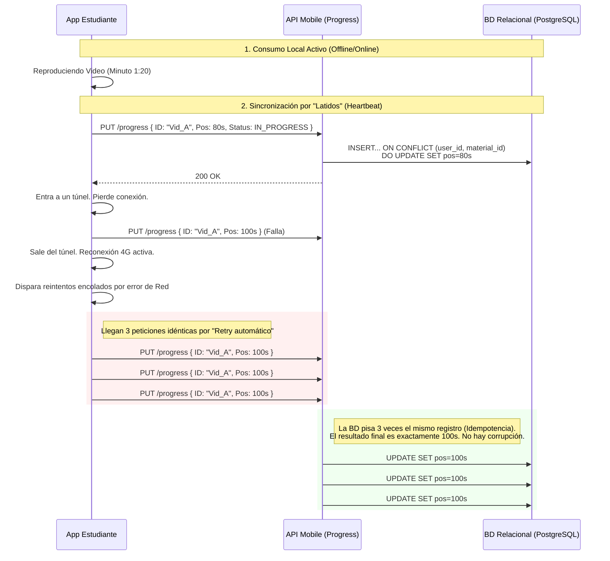

# 📈 Dominio: Sincronización de Progreso (Progress)

El motor de **Progreso** es el latido digital de la plataforma. La premisa del producto es que la experiencia educativa debe ser continua. Un estudiante debe poder comenzar a leer un PDF en la Web durante la mañana, bloquear la computadora, abrir la aplicación de iOS en el autobús y reanudar exactamente en el párrafo donde quedó.

---

## 🔄 El Principio de Sincronización Idempotente

En redes celuluares (3G/4G), enviar actualizaciones a la API de tipo "Avancé 1 metro más" es letal. Si se pierde un mensaje, el progreso del estudiante se corrompe y puede repetir lecciones terminadas.

Por lo tanto, la API de Progreso ignora los incrementos. Exige **Estados Absolutos**.

### Reglas de Guardado
1. **El App Reproduce Localmente:** El usuario lee o visualiza en su móvil. El móvil anota un "Punto de Guarda" localmente cada ciertos segundos.
2. **Ping de Transmisión (Upsert):** El fondo del sistema dispara el nuevo estado absoluto a la API: *"El alumno UUID-1 está en el Módulo UUID-2, estado: `COMPLETED`, posición: `75%`"*.
3. **Guardado Atómico:** Si el móvil se desconecta y envía ese mismo mensaje 15 veces seguidas de forma errática durante una hora, no importa. El progreso de la base de datos se pisa a sí mismo exactamente con el mismo valor (75%).

---

## ⚙️ Efecto Mariposa (Disparador de Recompensas)

El Progreso no ocurre de forma aislada.
Cuando la API procesa que un estado pasa de `IN_PROGRESS` a `COMPLETED` (por ejemplo, el video de matemáticas terminó), la API no bloquea al usuario esperando a ver qué hacer con eso; internamente, emite un mensaje en ráfaga a **RabbitMQ**.

Ese evento es pescado por los módulos Gamificados de la plataforma (Workers en la sombra) que, sin interrumpir la visualización del usuario, le otorgan al perfil del estudiante un *"Achievement"* o medalla ("Matemático Novato").
