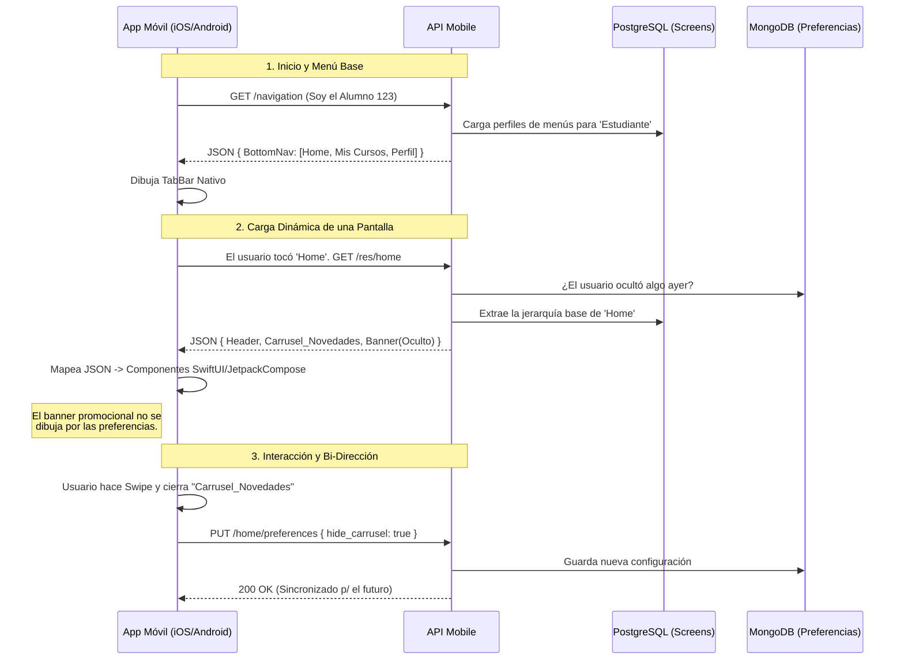

# 🎨 Dominio: Server-Driven UI (Orquestación Visual)

En las aplicaciones móviles clásicas, cada pantalla, botón de navegación y caja promocional deben ser programadas directamente (Hardcoded) en el código nativo de Swift o Kotlin. Si quieres cambiar el diseño de la portada, debes enviar una actualización forzada a App Store y esperar aprobación.

En EduGo rompemos este paradigma utilizando la entidad de **Screen**. La API Mobile decide en tiempo real **qué componentes** (Árboles JSON) dibujará la aplicación móvil, alterando visualmente el producto conforme el alumno interactúa.

---

## 🏗️ El Proceso de Orquestación Dinámica

Cada vez que la aplicación nativa o Web arranca, actúa casi como un "navegador ciego" que pide instrucciones de pintura al servidor en tres grandes fases.



### 1. Fase de Estabilización Base (Navegación Maestro)
Tan pronto se comprueba el inicio de sesión, el front-end interroga al backend sobre qué permisos le han sido conferidos en la UI principal.

* El servidor evalúa al usuario (`Estudiante` vs `Padre`).
* Para un `Padre`, el menú inferior omitirá íconos directos de "Mis Evaluaciones" e inyectará botones del tipo "Rastreador de Hijos".

### 2. Fase de Ensamblaje de Vista (Renderización)
Imagina que el estudiante toca la sección "Inglés Básico". La App solicitará a la API que le proporcione la "Pantalla" (Screen) designada con la llave de recurso (ej: `resourceKey: english_basics`).

El servidor despacha un contrato JSON altamente abstracto. Algo parecido a:
```json
{
  "screen_title": "Bienvenido a Inglés",
  "layout": "VERTICAL_SCROLL",
  "blocks": [
    { "type": "HeroHeader", "img_url": "amazon...", "text": "¡Level 1!" },
    { "type": "CarouselVideos", "data_source_id": "materials_vid_subset" },
    { "type": "PromotionalBanner", "action_deep_link": "edugo://assessments/101" }
  ]
}
```

La App nativa mapeará `"HeroHeader"` a sus componentes Swift/Kotlin locales y los dibujará en el orden dictado por el servidor. **Si mañana en campaña promocional la Institución decide agregar un banner extra, recargamos el JSON. El móvil lo reflejará instantáneamente.**

---

## 🎛️ Fase de Personalización (Preferencias Bi-Direccionales)

El SDUI no es un monólogo, es dinámico.

Si un estudiante presiona una "x" en la esquina de un componente de "Recomendaciones de Cursos", la aplicación móvil emitirá un reporte de eventos hacia el backend.
La API guardará la visualización de esa instancia específica de Screen dentro de un mapa de Preferencias de usuario (Preferences Map). ¿El resultado? Desde cualquier plataforma por la que ingrese el estudiante en el futuro, el motor Server-Driven excluirá orgánicamente ese mosaico de "Recomendaciones", entregando una experiencia curada.
