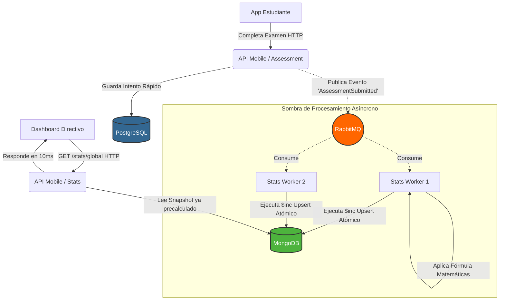

# 📊 Dominio: Analítica Transaccional (Stats)

En un entorno masivo de estudiantes realizando exámenes y avanzando por módulos cada milisegundo, responder a la pregunta *"¿Cuál es el promedio de este curso?"* calculándolo en línea (`SELECT AVG(...) FROM ...`) sería equivalente a tumbar intencionalmente la base de datos SQL productiva.

El módulo **Stats** es la barrera analítica que prohíbe las operaciones costosas en caliente, enfocándose en la **Proyección Asíncrona**.

---

## 🏭 El Flujo de Agregación de Métricas

La arquitectura de EduGo emplea bases de datos especializadas para evitar los cuellos de botella mediante asincronismo (Event-Driven Architecture).

### Componentes de la Ola de Eventos

1. **La Ola Inicial:** Cada vez que un `Assessment` es terminado vía HTTP (Capa Transaccional normal en Postgres), el servidor no calcula promedios. Dispara un mensaje ciego a las espaldas a **RabbitMQ**.
2. **Los Trabajadores Silenciosos:** Un Cluster de Daemons (Workers en un entorno aislado) escucha los latidos de RabbitMQ. Consumen `"Alumno X obtuvo 95 en Curso Y"`.
3. **El Incremento Cíclico (MongoDB):** Estos workers no buscan recalcular todo, aplican fórmulas de *Promedio Móvil* y comandos `$inc` optimizados para **MongoDB**, los cuales editan exclusivamente un documento ligero "Stats" atado al curso Y.

---

## 📈 Modalidades de Consumo

### Visión Global Institucional
Cuando el usuario entra a la pantalla de resumen administrativo, el front-end invoca la petición Global. Esto lee instantáneamente un Snapshot guardado en caché (Redis/Mongo) de los KPIs de toda la plataforma: Estudiantes activos del mes, porcentaje de aprobación masivo, etc.

### Microscopio Unitario (El Profesor)
Si el maestro abre los detalles del curso de Biología 101, el front-end de forma agresiva pide los Stats **de esa unidad en particular**.
Mágicamente, la lectura tarda 10 milisegundos. ¿La razón? Todo el esfuerzo algebraico se procesó ayer por la noche en los procesadores asíncronos en los workers, y MongoDB está entregando un mero documento JSON ya listo:
`{ "Promedio_Clase": 82, "Tasa_Desercion": "5%" }`
