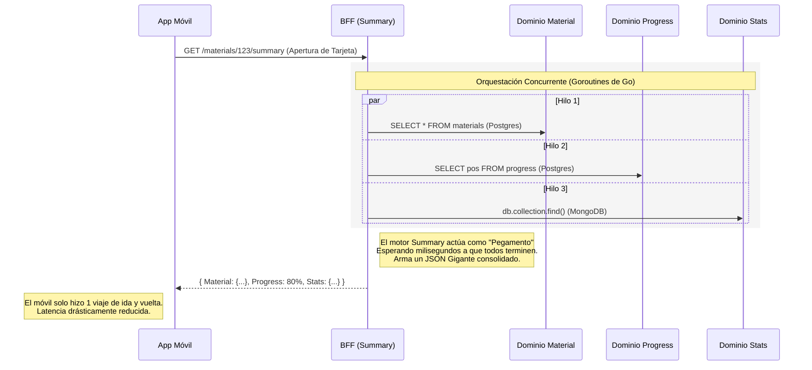

# 🧩 Dominio: Optimizador BFF (Backend For Frontend)

La magia negra de la velocidad en dispositivos 3G. En la vieja escuela del diseño de APIs, una aplicación móvil debía saltar de un dominio a otro para pintar una sola vista en la pantalla. Esta es la pesadilla del *Over-Fetching*.

El módulo **Summary** es el salvavidas contra esta sobrecarga.

---

## 🚀 El Proceso del Compendio Híbrido

Cuando el alumno hace 'Tap' sobre el curso `"Mitad de la Edad Media"`, la tarjeta final en iOS necesita presentar demasiada información junta: 
* El título y autor *(Entidad Material)*.
* El reloj de tiempo si dejó el video por la mitad *(Entidad Progress)*.
* Si tiene evaluaciones asociadas pendientes *(Entidad Assessment)*.
* El porcentaje de egresados de esa rama *(Entidad Stats)*.

**¿Cómo funciona el negocio para el Front-end? Pidiendo todo en un solo ticket.**

### Paso a paso:
1. **Ahorro de DNS y Batería:** El cliente móvil dispara **una única petición** al motor de Summary.
2. **Orquestación Subyacente:** En el milisegundo que ingresa la petición, las `goroutines` de la API (hilos asíncronos nativos de Go) disparan al backend consultas *en paralelo* a las entidades de Dominios respectivas en las bases de datos (Postgres y Mongo). 
3. **Fusión Atómica:** El motor Summary actúa como pegamento. Espera a todos los pequeños flujos, engoma los pedacitos y devuelve un JSON gigante y masivo ("El Compendio").
4. **Respuesta Rápida:** La antena celular del alumno descargó en una sola oleada la totalidad del contexto, haciendo la animación visual imperceptiblemente veloz.
